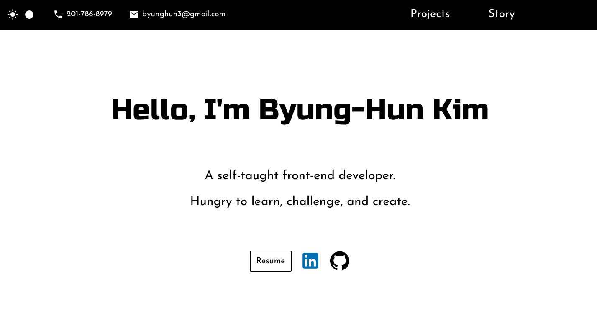
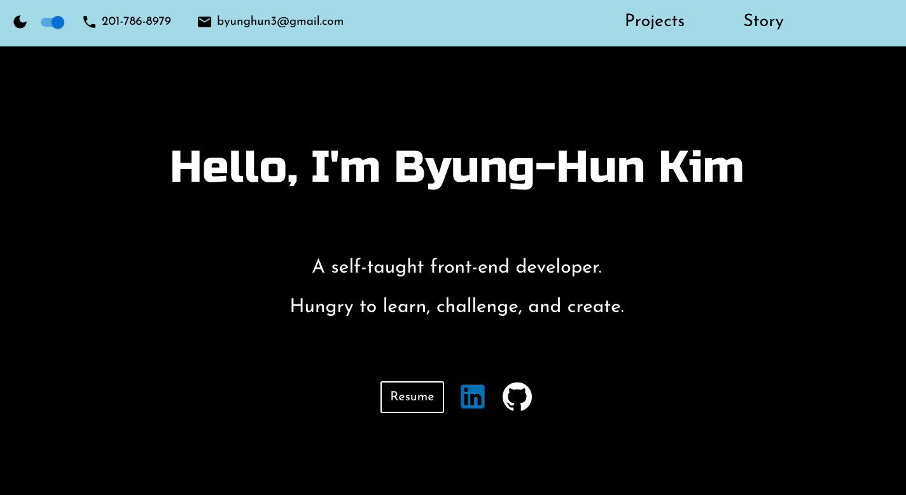

# Portfolio

This app showcases my resume, profile, coding projects, and story behind pursuing web development.

## Live Demo

https://byunghun3.github.io/portfolio/

## Technologies

This project was created with:

* React.js
* Typescript
* Styled-components
* Material UI
* Jest
* ESLint

## Usage

Light Mode

Dark Mode

The main profile section contains an introduction, my phone and email contact, and links to my PDF resume, LinkedIn, and Github pages.

The nav bar also includes a toggle to switch between light and dark mode and links to Projects and Story sections.

The Projects section displays my first three React projects: Revd Bookstore, Golf Course Weather, and Portfolio apps. 

Each project card contains a screenshot of the main page, a list of tech stacks used, and links to the live demo site and Github code page.

The Story section contains a brief story behind my web development journey and a button for scrolling all the way to the top of the page in the bottom right corner. 

## Reflection

My goal for this project was to build an app to introduce my web development journey and display my profile and projects.

I also treated this project as further practice for developing React apps.  

I paid particular attention to visual or styling details for this single-page app. Upon clicking any of the three hash links ("Projects" and "Story" in navbar, and "Back to Top" at the bottom of the page) and navigating to each section, I called the history.pushState() method to remove any added hash text from the URL. 

I was also careful with how I handled the scroll snap with responsiveness in mind, making sure that when the window size shrank, the snap didn't hide any content.   

Because adding tests at the end had me incorporating aria-labels to some elements, it got me thinking more about using them more often for both testing, SEO, and accessibility purposes. This will be an important skill to develop for my professional career.

This being my third React project, I reazlied how much more proficient and efficient with React and other complementary libraries I've become. For future projects, I hope to learn about incorporating a back end with Node.js.
